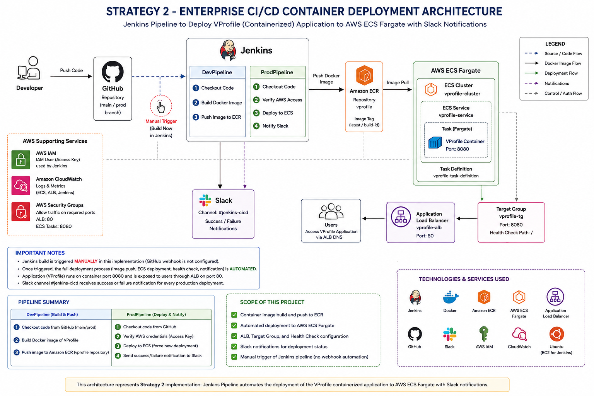

# Enterprise CI/CD Container Deployment

## Strategy 2 — VProfile Container Deployment to AWS ECS

## Project Overview

This project implements Strategy 2 of the VProfile deployment project using Jenkins, Docker, Amazon ECR, Amazon ECS Fargate, Application Load Balancer, AWS IAM, and Slack.

The primary objective of Strategy 2 is to automate the deployment of the containerized VProfile application to AWS ECS through Jenkins.

The application is packaged as a Docker container, stored in Amazon ECR, and deployed to an ECS Fargate service. The application is exposed through an Application Load Balancer and its deployment health is verified using the ECS target group.

Jenkins also sends the deployment status to a dedicated Slack channel.

---

## Project Objectives

- Containerize the VProfile application using Docker
- Build the VProfile Docker image using Jenkins
- Store the Docker image in Amazon ECR
- Deploy the application to AWS ECS Fargate
- Configure ECS service and task definition
- Configure Application Load Balancer and target group
- Verify ECS deployment and target health
- Integrate Jenkins with AWS using IAM credentials
- Integrate Jenkins with Slack for deployment notifications
- Maintain deployment evidence through project screenshots

---

## Technology Stack

| Technology | Purpose |
|------------|---------|
| GitHub | Source code and Jenkins pipeline repository |
| Jenkins | Pipeline execution and deployment automation |
| Docker | Application containerization |
| Amazon ECR | Docker image repository |
| Amazon ECS | Container orchestration |
| AWS Fargate | Container execution |
| Application Load Balancer | External application access |
| Target Group | ECS task registration and health checking |
| AWS IAM | Jenkins AWS authentication |
| Slack | Deployment notifications |
| Ubuntu | Jenkins server environment |

---

## Architecture

The architecture diagram represents the final Strategy 2 implementation.

The solution consists of the following major components:

- GitHub repository
- Jenkins
- StagePipeline
- ProdPipeline
- Docker
- Amazon ECR
- Amazon ECS Fargate
- ECS task definition
- Application Load Balancer
- Target Group
- VProfile container
- AWS IAM
- Slack

The VProfile container runs on port 8080 and is exposed through the Application Load Balancer.

---

## Jenkins Pipeline

### StagePipeline

The StagePipeline is responsible for the container image build and image upload process.

The pipeline performs the following operations:

1. Checkout application source code
2. Build the VProfile Docker image
3. Push the Docker image to Amazon ECR
4. Maintain the image for ECS deployment

The Dockerfile used for the application container is located at:

`Docker-files/app/multistage/Dockerfile`

The VProfile image is stored in the Amazon ECR repository and was verified using the `latest` image tag.

---

### ProdPipeline

The ProdPipeline is responsible for the production deployment of the VProfile application to AWS ECS.

The production Jenkinsfile is located at:

`ProdPipeline/Jenkinsfile`

The production pipeline contains the following stages:

1. Checkout SCM
2. Verify AWS Access
3. Deploy to ECS
4. Send Slack notification

AWS access is verified using:

`aws sts get-caller-identity`

The ECS deployment is performed using:

`aws ecs update-service --cluster enterprise-cicd-cluster --service vprofile-task-service-gi6jxdoc --force-new-deployment`

This triggers a new deployment of the VProfile ECS service.

---

## AWS Infrastructure

### Amazon ECR

Amazon Elastic Container Registry is used to store the VProfile Docker image generated by the Jenkins pipeline.

The image stored in ECR is used by the ECS task definition during deployment.

---

### Amazon ECS

The VProfile application is deployed to Amazon ECS using AWS Fargate.

ECS Cluster:

`enterprise-cicd-cluster`

ECS Service:

`vprofile-task-service-gi6jxdoc`

The ECS service was successfully verified as active with one desired task and one running task.

---

### AWS Fargate

The VProfile application runs as a Docker container using AWS Fargate.

Container port:

`8080`

The ECS task definition references the VProfile container image stored in Amazon ECR.

---

### Application Load Balancer

An Application Load Balancer provides external access to the VProfile application.

The ALB forwards application traffic through the configured target group to the ECS Fargate task.

The VProfile login page was successfully accessed through the Application Load Balancer after deployment.

---

### Target Group

The ECS service is connected to an Application Load Balancer target group.

The target group forwards traffic to the VProfile container on port:

`8080`

The ECS target was successfully verified as:

`healthy`

This confirmed that the deployed VProfile task was reachable through the configured load balancing infrastructure.

---

## Jenkins AWS Integration

Jenkins uses the configured AWS credential:

`aws-jenkins`

Before performing the ECS deployment, the pipeline verifies AWS authentication using:

`aws sts get-caller-identity`

This confirms that Jenkins has the required AWS access before executing the deployment stage.

---

## Slack Integration

Slack was integrated with Jenkins using the Jenkins Slack Notification plugin.

A dedicated Slack channel was created:

`#jenkins-cicd`

The production pipeline sends deployment status notifications to this channel.

Successful deployment notification:

`SUCCESS: ProdPipeline deployed VProfile to ECS.`

The Slack notification was successfully verified after a real production ECS deployment.

---

## Deployment Verification

The deployment was verified at multiple levels.

### Jenkins

The ProdPipeline completed successfully.

### AWS ECS

The final ECS service state was verified as:

- Status: ACTIVE
- Desired Count: 1
- Running Count: 1
- Pending Count: 0
- Rollout: COMPLETED

### Target Group

The ECS target was verified as:

- Port: 8080
- State: healthy

### Application

The VProfile login page was successfully loaded through the Application Load Balancer.

### Slack

The production deployment successfully generated the following Slack notification:

`SUCCESS: ProdPipeline deployed VProfile to ECS.`

---

## Pipeline Trigger

The Jenkins pipeline is manually triggered in the current implementation.

A GitHub webhook was not configured as part of Strategy 2.

Once the Jenkins pipeline is triggered, the deployment process is automated through AWS ECS.

The automated deployment includes:

- AWS authentication
- ECS service update
- ECS rollout
- Target health verification
- Slack deployment notification

This matches the deployment automation objective of Strategy 2.

---

## Repository Structure

    enterprise-cicd-container-deployment/
    │
    ├── Docker-files/
    │   └── app/
    │       └── multistage/
    │           └── Dockerfile
    │
    ├── StagePipeline/
    │   └── Jenkinsfile
    │
    ├── ProdPipeline/
    │   └── Jenkinsfile
    │
    ├── screenshots/
    │   ├── S2-01-GITHUB-PROD-BRANCH.png
    │   ├── S2-02-PROD-JENKINSFILE.png
    │   ├── S2-03-JENKINS-PROD-SUCCESS.png
    │   ├── S2-04-JENKINS-AWS-ACCESS.png
    │   ├── S2-05-JENKINS-ECS-DEPLOY.png
    │   ├── S2-06-ECR-VPROFILE-LATEST.png
    │   ├── S2-07-ECS-SERVICE-ACTIVE.png
    │   ├── S2-08-ECS-ROLLOUT-COMPLETED.png
    │   ├── S2-09-TARGET-HEALTHY.png
    │   ├── S2-10-ALB-VPROFILE-LOGIN.png
    │   ├── S2-11-ECS-TASK-DEFINITION.png
    │   ├── S2-12-TARGET-GROUP-HEALTHCHECK.png
    │   └── S2-13-SLACK-PRODPIPELINE-SUCCESS.png
    │
    ├── pom.xml
    ├── screenshots/enterprise-cicd-architecture.png
    └── README.md

The earlier `pipeline/` directory was removed after the dedicated `StagePipeline` and `ProdPipeline` implementations were created.

---

## Evidence

The `screenshots` directory contains the implementation evidence for Strategy 2.

| Screenshot | Description |
|------------|-------------|
| S2-01 | GitHub production branch |
| S2-02 | Production Jenkinsfile |
| S2-03 | Successful Jenkins production pipeline |
| S2-04 | Jenkins AWS access verification |
| S2-05 | Jenkins ECS deployment |
| S2-06 | VProfile image in Amazon ECR |
| S2-07 | ECS service active |
| S2-08 | ECS rollout completed |
| S2-09 | ECS target healthy |
| S2-10 | VProfile login page through ALB |
| S2-11 | ECS task definition |
| S2-12 | Target group health check |
| S2-13 | Slack production deployment notification |

---

## Final Result

The VProfile application was successfully deployed as a Docker container to AWS ECS Fargate.

The final implementation successfully demonstrated:

- Docker image creation
- Amazon ECR image storage
- Jenkins AWS authentication
- ECS service deployment
- ECS rollout completion
- Target group health verification
- Application access through the Application Load Balancer
- Slack deployment notification

The completed Strategy 2 solution demonstrates a Jenkins-based container deployment workflow using GitHub, Docker, Amazon ECR, Amazon ECS Fargate, Application Load Balancer, AWS IAM, and Slack.
